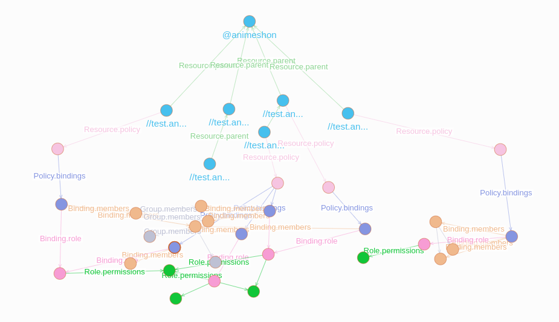

# gRBAC - Graph Role-Based Access Control

[](https://pkg.go.dev/github.com/grbac/grbac)

<a href="https://animeshon.com/">
  
</a>

---

A cloud-native graph implementation of the Role-Based Access Control (RBAC) authorization architecture powered by [dgraph](https://dgraph.io/).

**NOTE: This project is developed and maintained by [Animeshon](https://animeshon.com) where it is running in production.**


## Build with Golang

```
go build -o bin/grbac ./cmd
```

## Build with Docker

```
docker build -t grbac/grbac:latest .
```

## Run examples (gRPC only)

Run gRPC docker-compose:

```
docker-compose -f examples/grpc/docker-compose.yaml up
```

Run integration tests:

```
export INTEGRATION_TEST_DGRAPH_ENDPOINT=127.0.0.1:9060
go test -tag=integration ./...
```

Visit `https://play.dgraph.io/?latest` and connect to the endpoint `http://127.0.0.1:8060`.

Run the following generic DQL query:
```
{
  query(func:type(Resource)){
    expand(_all_) {
      expand(_all_) {
        expand(_all_) {
          expand(_all_) {
            expand(_all_) {
              expand(_all_)
            }
          }
        }
      }
    }
  }
}
```

The following image is an example of the expected output:



## Play with gRBAC

After succesfully running the gRPC `docker-compose` as described in the **previous paragraph**, build gRBAC locally and execute a random CLI command:

```
go build -o bin/grbac ./cmd
```

```
./bin/grbac accesscontrol create-permission \
    --address "127.0.0.1:9070" --insecure \
    --permission.name="permissions/grbac.test.permission"
```

_Keep experimenting with other commands or through a gRPC client!_

## Resources

- [Animeshon APIs](https://github.com/animeapis/animeapis/tree/master/animeshon/grbac)
- [Animeshon APIs Client Library for Go](https://github.com/animeapis/api-go-client/tree/master/grbac)
- [Animeshon Protocol Buffers for Go](https://github.com/animeapis/go-genproto/tree/master/grbac)
- [Animeshon Compiled Protocol Buffers](https://github.com/animeapis/proto-binary/tree/master/grbac)

## Known Issues

- etags are not implemented
- atomic group changes (AddGroupMember and RemoveGroupMemeber) are not implemented
- resource parent transfer (TransferResource) is not implemented
- [limits and quotas](https://cloud.google.com/iam/quotas) are not implemented
- there is no maximum distance set for `shortest` queries
- groups can currently include other groups - this behavior should be discussed
- partial updates will return partial resources - complete resources should be returned instead

## Roadmap

- [ ] resolve known issues
- [ ] remove Animeshon internal business logic
- [ ] move protobuf definitions to this organization
- [ ] generate missing grpc clients (e.g. Java, Python, C#, ...)
- [ ] publish docker image to Docker Hub
- [ ] build the project through Bazel instead of the Go toolchain
- [ ] add unit tests on top of integration tests
- [ ] add monitoring and tracing

## Off-topic: gRBAC meaning

The name gRBAC comes from `g` + `RBAC` where `g` stands for:

- `graph` as it is implemented on top of a graph database and leverages graph's properties
- `gRPC` as its implementation is completely gRPC native
- `google` as this implementation aims at mirroring the Google Cloud IAM architecture

and RBAC stands for [Role-Based Access Control](https://en.wikipedia.org/wiki/Role-based_access_control).
